[English](README.en.md) | **简体中文**

<picture>
  <source media="(max-width: 640px) and (prefers-color-scheme: dark)" srcset="assets/presentation/hero-mobile-dark.svg">
  <source media="(max-width: 640px)" srcset="assets/presentation/hero-mobile-light.svg">
  <source media="(prefers-color-scheme: dark)" srcset="assets/presentation/hero-dark.svg">
  
</picture>

**将支持的剪映 draft bundle 解析成多轨模型，用 Python 或 CLI 修改字幕、音频与转场材料。**

`v0.1.0` · `Python 3.12+` · [MIT](LICENSE)

[Website](https://draftseam.lei6393.com) · [Demo record](docs/demo-results.json)

## 为什么使用

当修改对象是字幕或配音位置时，只拿到成片很难保留原来的编辑结构。draftseam 提供对 template.tmp 的结构化读取和写回，并把常见字幕、音频和转场操作收进窄接口。是否能在具体剪映版本中打开，仍需对实际工程验证。

## 架构

<picture>
  <source media="(max-width: 640px) and (prefers-color-scheme: dark)" srcset="assets/presentation/architecture-mobile-dark.svg">
  <source media="(max-width: 640px)" srcset="assets/presentation/architecture-mobile-light.svg">
  <source media="(prefers-color-scheme: dark)" srcset="assets/presentation/architecture-dark.svg">
  
</picture>

bundle.py 负责目录 I/O，parser.py 与 schema.py 建立允许额外字段的 Draft 模型，agent_api.py 原地修改材料和 segment，writer.py 写回 JSON。draft_info.json 等旁文件视为 opaque 数据，不解密或同步修改。

格式边界见 [docs/format_notes.md](docs/format_notes.md)。字幕是 materials.texts 与 text track segment 的组合；时间参数以秒输入、以微秒存储。

## 安装

需要 Python 3.12+。以下演示只在本地解析 JSON，并在临时副本中写入。

```bash
git clone https://github.com/SuperMarioYL/draftseam.git
cd draftseam
python3 -m venv .venv
source .venv/bin/activate
python -m pip install -e .
```

## 快速开始

使用仓库自带的示例 bundle，验证模型 round-trip 相等、字幕材料从 1 变 2、opaque 文件字节不变；没有在剪映/CapCut 应用中重新打开验收。

```bash
python -m draftseam.cli inspect tests/fixtures/sample_project
python examples/presentation_demo.py
```

完整输入在 [tests/fixtures/sample_project](tests/fixtures/sample_project/)。[演示脚本](examples/presentation_demo.py) 自动复制、修改、读回并清理临时目录。

## 使用

inspect 打印轨道树；add-subtitle 接受 --text、--start、--dur，可选 --size 和 --color；add-voiceover 写音频材料及 segment；add-transition 追加转场材料。CLI 的 add-* 会原地写回，Python API 则需显式调用 write_bundle。

## 实际 Demo

<picture>
  <source media="(max-width: 640px) and (prefers-color-scheme: dark)" srcset="assets/presentation/process-mobile-dark.svg">
  <source media="(max-width: 640px)" srcset="assets/presentation/process-mobile-light.svg">
  <source media="(prefers-color-scheme: dark)" srcset="assets/presentation/process-dark.svg">
  
</picture>

### 查看示例工程

读取 3 条轨道及材料列表。

```text
$ python -m draftseam.cli inspect tests/fixtures/sample_project
剪映 draft: sample_project  version=360000 new_version=75.0.0  fps=30.0  duration=10.000s
materials: videos=2 audios=1 texts(字幕)=1 effects=0 video_effects=0 transitions(转场)=1
tracks: 3
  [0] 视频轨 (id=AAAAAAAA-AAAA-4AAA-8AAA-AAAAAAAAAAAA) segments=2
      - seg material=11111111-1111-4111-8111-111111111111 start=0.000s dur=5.000s
      - seg material=22222222-2222-4222-8222-222222222222 start=5.000s dur=5.000s
  [1] 配音轨 (id=BBBBBBBB-BBBB-4BBB-8BBB-BBBBBBBBBBBB) segments=1
      - seg material=33333333-3333-4333-8333-333333333333 start=6.000s dur=4.000s
  [2] 字幕轨 (id=CCCCCCCC-CCCC-4CCC-8CCC-CCCCCCCCCCCC) segments=1
      - seg material=44444444-4444-4444-8444-444444444444 start=1.500s dur=2.000s
        字幕: '你好，剪映'
转场 materials.transitions: 1
  - 叠化 dur=0.500s id=55555555-5555-4555-8555-555555555555
```

### 修改并读回

在临时副本中新增字幕，核对模型与 opaque 文件。

```text
$ python examples/presentation_demo.py
{
  "before": {
    "tracks": 3,
    "texts": 1
  },
  "after": {
    "tracks": 3,
    "texts": 2
  },
  "subtitle": "A new local subtitle",
  "roundtrip_equal": true,
  "draft_info_unchanged": true
}
```

## 能力与接入

<picture>
  <source media="(max-width: 640px) and (prefers-color-scheme: dark)" srcset="assets/presentation/integrations-mobile-dark.svg">
  <source media="(max-width: 640px)" srcset="assets/presentation/integrations-mobile-light.svg">
  <source media="(prefers-color-scheme: dark)" srcset="assets/presentation/integrations-dark.svg">
  
</picture>

它处理工程结构，渲染与应用内兼容性由剪辑软件负责。修改真实工程前请保留副本；本工具的一代 .bak 不等于完整版本管理。


## 配置

write 会保留上一代 template.tmp.bak。list-projects 可用 --root 指定工程目录。结构化模型允许额外字段，但不理解所有未知字段的语义。add-transition 只添加材料条目，不等于已经把转场挂到相邻片段。

## 路线图与范围

当前提供所支持 JSON bundle 的读写与编辑辅助函数。加密元数据一致性、更多版本的实际工程验证和批量工作流仍为后续方向；没有已上线的 Pro 套餐或 MP4 渲染器。

- 只验证了自带 fixture，不能声称所有剪映版本或字段都无损兼容。
- 不解密 draft_info，不渲染视频。
- 转场材料的存在不保证应用已将其连接到片段。

[Terminal recording](assets/demo.gif) · [Recording script](docs/demo.tape)

## 许可证

[MIT](LICENSE)
