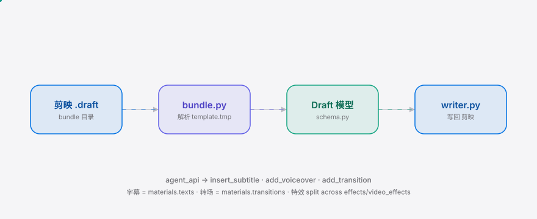

<div align="right"><sub><b>简体中文</b>&nbsp;&nbsp;⇄&nbsp;&nbsp;<a href="./README.en.md">English</a></sub></div>

<picture>
  <source media="(prefers-color-scheme: dark)" srcset="./assets/hero-dark.svg">
  <source media="(prefers-color-scheme: light)" srcset="./assets/hero-light.svg">
  
</picture>

<p align="center"><sub>让 coding agent 直接读写剪映原生 <code>.draft</code> 时间线——不再导 MP4 重剪。</sub></p>

<p align="center">
  <a href="./LICENSE"></a>
  <a href="https://github.com/SuperMarioYL/draftseam/releases"></a>
  <a href="https://github.com/SuperMarioYL/draftseam/actions/workflows/ci.yml"></a>
  
  
  
</p>

**停止导出 MP4 再手工重剪——让 Claude Code 直接改你的剪映工程文件。** draftseam 把剪映原生 `.draft` 时间线解析成结构化多轨模型，agent 插入字幕 / 配音 / 转场，再写回为可重新打开的原生时间线，轨道结构零丢失。

## 为什么是现在

剪映（CapCut）是中国创作者事实上的剪辑工具，但它的 `.draft` 工程格式是未公开的目录 bundle，coding agent 完全无法触碰原生时间线——今天唯一的"AI 改视频"路径是导出 MP4 再手工重剪，轨道、字幕、转场结构全丢。draftseam 补上这道缝：owning parse/write of 剪映的 `.draft` 格式资产。它落在 agent-video 的需求浪尖上——[OpenMontage](https://github.com/OpenMontage/OpenMontage)（48k★）与 [hyperframes](https://github.com/hyperframes/hyperframes)（41k★）已经把"agent 直接产出可编辑时间线"变成共识，但二者都不碰剪映原生格式；draftseam 是这条链上缺失的格式适配层。Claude Code 是 CN 创作者生成时间线编辑的事实主力 agent，draftseam 让它第一次能直接读写剪映工程。

## 目录

- [架构](#架构)
- [安装与快速开始](#安装与快速开始)
- [用法](#用法)
- [Demo](#demo)
- [路线图](#路线图)
- [付费](#付费)
- [许可证](#许可证)

##  架构

剪映 draft 是一个**目录 bundle**：`template.tmp`（纯 JSON：`version` + `tracks` + `materials`）+ `draft_info.json`（base64/AES 加密，opaque，draftseam 不解密）。draftseam 只读写 `template.tmp`——没有二进制 codec、没有 varint、没有 `construct` 依赖，整个时间线就是普通 JSON。

<picture>
  <source media="(prefers-color-scheme: dark)" srcset="./assets/atlas-dark.svg">
  <source media="(prefers-color-scheme: light)" srcset="./assets/atlas-light.svg">
  
</picture>

核心数据流：`bundle.py` 拥有目录 bundle I/O → `parser.py` 把 `template.tmp` JSON 提升为 pydantic `Draft` 模型（`extra="allow"` 容忍剪映的未文档化字段）→ `writer.py` 把模型降回 `template.tmp` JSON，round-trip 语义无损 → `agent_api.py` 暴露 `insert_subtitle`（写 `materials.texts`）/ `add_voiceover` / `add_transition`，agent 不碰 JSON。字幕是 `materials.texts` 条目，由 text 轨上的 segment 引用——没有"Subtitle"轨类型。

##  安装与快速开始

```bash
pip install draftseam                              # 1. 安装（<30s）
draftseam inspect tests/fixtures/sample_project/  # 2. 打印多轨时间线树
draftseam add-subtitle tests/fixtures/sample_project/ \
  --text "AI 生成字幕" --start 2.0 --dur 1.5         # 3. agent 插入字幕并写回
```

<details><summary>示例输出</summary>

```
剪映 draft: sample_project  version=360000 new_version=75.0.0  fps=30.0  duration=10.000s
materials: videos=2 audios=1 texts(字幕)=1 effects=0 video_effects=0 transitions(转场)=1
tracks: 3
  [0] 视频轨 segments=2
      - seg material=1111... start=0.000s dur=5.000s
  [1] 配音轨 segments=1
      - seg material=3333... start=6.000s dur=4.000s
  [2] 字幕轨 segments=1
      - seg material=4444... start=1.500s dur=2.000s
        字幕: '你好，剪映'
inserted 字幕 material C879... at 1.5s (+2.0s) and wrote .../template.tmp
```

</details>

写回后用剪映重新打开 bundle 目录——新字幕作为 `materials.texts` 条目出现在字幕轨上，完全可编辑。

##  用法

```bash
# 打印完整多轨时间线树（视频轨/字幕轨/配音轨/转场/特效 + 时间戳）
draftseam inspect ~/Movies/JianyingPro/User\ Data/Projects/com.lveditor.draft/myproject/

# 列出本机所有剪映 draft 工程
draftseam list-projects

# agent 插入字幕（materials.texts 条目 + text 轨引用 segment）
draftseam add-subtitle myproject/ --text "AI 字幕" --start 2.0 --dur 1.5

# agent 插入配音（materials.audios + audio 轨 segment）
draftseam add-voiceover myproject/ --path /path/vo.mp3 --start 0.0 --dur 4.0

# 追加转场条目到 materials.transitions
draftseam add-transition myproject/ --name 叠化 --dur 0.5

# 规范化重写 template.tmp（证明 parse → write round-trip 安全）
draftseam write myproject/
```

编程式 API（agent 直接 import，不必走 shell）：

```python
from draftseam import DraftBundle, parse_bundle, write_bundle, insert_subtitle

bundle = DraftBundle.resolve("tests/fixtures/sample_project/")
draft = parse_bundle(bundle)                          # template.tmp JSON -> Draft 模型
insert_subtitle(draft, text="AI 字幕", start=2.0, dur=1.5)  # 改 materials.texts + text 轨
write_bundle(draft, bundle)                           # 写回 template.tmp，剪映可重新打开
```

更多见 [`examples/agent_insert_subtitle.py`](./examples/agent_insert_subtitle.py)。

##  Demo


agent 用 `draftseam add-subtitle` 往示例工程插入一条字幕，写回后 `materials.texts` 从 1 条变成 2 条，剪映重新打开 bundle 即可编辑新字幕。完整脚本见 [`docs/demo.tape`](./docs/demo.tape)，CI 在 [`demo.yml`](./.github/workflows/demo.yml) 用 vhs 渲染。

##  路线图

- [x] **m1 解析 draft**：真实剪映 `.draft` bundle 解析成 `Draft` 模型，`draftseam inspect` 打印多轨时间线树；`bundle.py` / `schema.py` / `parser.py` + 示例 fixture + [`docs/format_notes.md`](./docs/format_notes.md)
- [x] **m2 写回 draft**：`writer.py` 把 `Draft` 模型降回 `template.tmp` JSON，round-trip 语义无损（`tests/test_roundtrip.py` 通过）
- [x] **m3 agent 缝合**：`agent_api.py`（`insert_subtitle` / `add_voiceover` / `add_transition`）+ `cli.py` + agent demo + 双语 README + CI 渲染 demo gif
- [ ] **v0.2**：`draft_info.json` 加密形态与 `template.tmp` 的一致性校验；真实填充 draft 的 segment 字段名文档化
- [ ] **v0.3**：draftseam pro 批量层（N 个脚本 → N 条可编辑剪映时间线）

### draftseam vs 手工导出 MP4 重剪

| 维度 | draftseam | 手工 MP4 重剪 |
|---|:---:|:---:|
| agent 可直接编程改时间线 | ✓ | — |
| 字幕/配音/转场结构保留 | ✓ | ✗（重剪后丢失） |
| 剪映里可重新编辑 | ✓ | partial（需重排） |
| 不依赖未公开格式稳定性 | partial（依赖 `.draft` schema） | ✓ |
| 渲染产出 MP4 | —（产出可编辑时间线） | ✓ |

draftseam 产出的是可编辑时间线而非 MP4；如果你要的是成片渲染，draftseam 不是替代品。

##  付费

draftseam 的 OSS 核心（解析 / 写回 / agent 字幕·配音·转场原语 + CLI）**永久免费**，MIT 协议。商业营收路径是 **draftseam pro** 批量层：把 N 个脚本批量转成 N 条可编辑剪映时间线，面向 MCN / 创作者工作室，¥99–299/月/席位——OSS 核心证明了格式资产的所有权，pro 层把这份所有权变现。pro 层推迟到 v0.3。

##  许可证

[MIT](./LICENSE) © 2026 SuperMarioYL。提 issue 或 PR 见 [issues](https://github.com/SuperMarioYL/draftseam/issues)。

## 分享

```
draftseam — 让 Claude Code 直接读写剪映原生 .draft 时间线，不导 MP4 重剪。字幕/配音/转场结构零丢失，写回即可在剪映重新编辑。https://github.com/SuperMarioYL/draftseam
```

<p align="center"><sub><a href="./LICENSE">MIT</a> © 2026 SuperMarioYL</sub></p>
